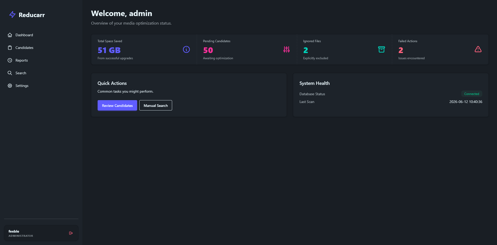

# Reducarr ⚡

Reducarr is an automated media optimization tool designed for Sonarr and Radarr. It monitors your library for oversized files and replaces them with more efficient versions (e.g., HEVC, AV1) based on your custom scoring rules.

Unlike simple "find and replace" tools, Reducarr is **hardlink-aware** and communicates directly with your torrent clients to ensure safe deletions without breaking your cross-seeding setup.



## ✨ Features

- **Automated Library Scanning**: Performs both full and incremental scans of your Sonarr and Radarr instances. (TODO cron)
- **Smart Scoring**: Identifies candidates based on size-to-duration ratios, bitrate, or absolute size.
- **Hardlink Awareness**: Tracks files via Inodes to safely manage deletions across multiple torrent clients.
- **Interactive Web Dashboard**:
    - **Candidates View**: Review and manually trigger optimizations.
    - **Manual Search**: Lookup any file in your collection and find better releases on the fly.
    - **Detailed Reports**: Keep track of every byte saved and every operation performed.
    - **Live Configuration**: Edit your `config.yaml` directly from the UI with a built-in YAML editor.
- **Interface**: Web UI with auth and CLI.

## 🚀 Quick Start

The easiest way to run Reducarr is via Docker Compose.

### 1. Create a configuration directory

```bash
mkdir -p /opt/reducarr/config
```

### 2. Create your `config.yaml`

Place your initial configuration in `/opt/reducarr/config/config.yaml`. See [Configuration](#-configuration) for an example.

### 3. Docker Compose

Create a `docker-compose.yml` file:

```yaml
services:
    reducarr:
        image: ghcr.io/ender-events/reducarr:main
        container_name: reducarr
        restart: unless-stopped
        user: "1000:1000"
        environment:
            - REDUCARR_UI_USER=admin
            - REDUCARR_UI_PASS=change_me
            - TZ=Europe/Paris
        volumes:
            - /opt/reducarr/config:/data
            # Mount your media storage to allow hardlink detection (Inode matching)
            - /mnt/storage/media:/media
        ports:
            - "8080:8080"
```

Run it with:

```bash
docker compose up -d
```

CLI still available

```bash
docker compose exec reducarr "/reducarr" health
```

## ⚙️ Configuration

Reducarr uses a simple YAML file for configuration. You can edit it through the Web UI once the app is running.

```yaml
sonarr:
    - name: "Local Sonarr"
      url: "http://sonarr:8989"
      apiKey: "YOUR_API_KEY"
      pathMappings:
          - remote: "/tv"
            local: "/media/tv"

radarr:
    - name: "Local Radarr"
      url: "http://radarr:7878"
      apiKey: "YOUR_API_KEY"

qbittorrent:
    - name: "Main Client"
      url: "http://qbittorrent:8080"
      username: "admin"
      password: "password"

scoring:
    # Trigger optimization if a file exceeds 150MiB per minute of duration
    maxRatio: "150MiB/min"
    # Don't delete files if they haven't seeded for at least 2 weeks
    minSeedDuration: "336h"

rateLimit: 50 # Max searches per hour (not implemented yet)
```

## 🛠️ Tech Stack

- **Backend**: Go 1.26.3
- **Frontend**: [Templ](https://templ.guide/), [HTMX 2.x](https://htmx.org/), [Tailwind CSS 4](https://tailwindcss.com/), [DaisyUI 5](https://daisyui.com/)
- **Database**: SQLite (via `modernc.org/sqlite`)
- **Container**: Multi-stage Docker build, `scratch` runtime.

## 📜 License

This project is licensed under the MIT License.
